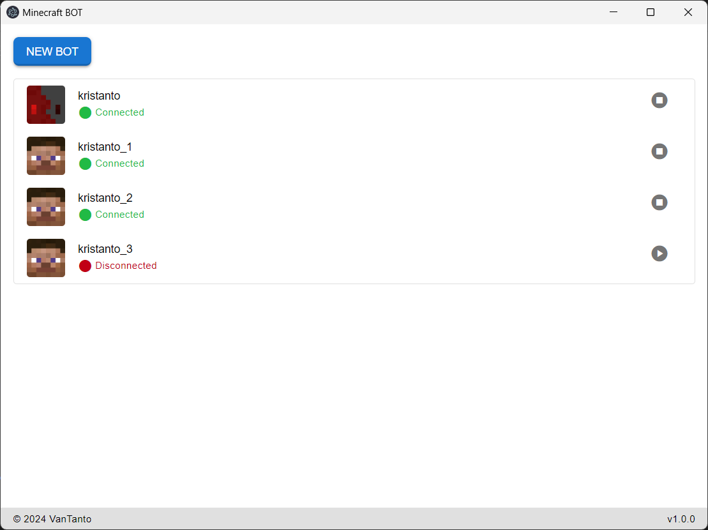

# Minecraft Bot

A Minecraft bot that connects to a server with an intuitive graphical user interface (GUI).

## Features

- Create a new bot
- Connect and disconnect the bot

### Planned Features

- Set Minecraft server address
- Store server and bot usernames
- Chat functionality

## Screenshots

Main Application Screen

*The main screen of the Minecraft Bot application.*

Username Entry Popup

*Popup window to enter the bot username.*

## Credits

- [Mineflayer](https://github.com/PrismarineJS/mineflayer) - Minecraft bot framework
- [Electron](https://www.electronjs.org/) - Framework for building cross-platform desktop applications

## License

This project is [MIT](/LICENSE) licensed.
