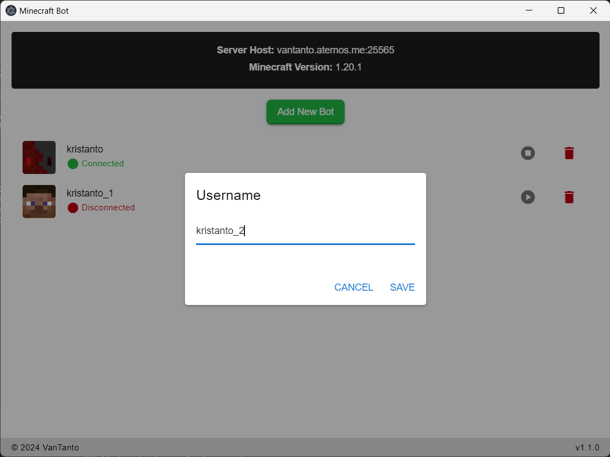

# Minecraft Bot

A Minecraft bot that connects to a server with an intuitive graphical user interface (GUI).

## Features

- Create a new bot
- Connect and disconnect the bot
- Store server and bot usernames
- Chat functionality (send/receive messages directly in chat window)

### Planned Features

- Scripting system (run custom scripts/automation for bots)

## Screenshots

Server Selector Screen

_The selector screen of the Minecraft Bot application._

Username list Screen

_The username list screen of the Minecraft Bot application._

Username Entry Popup

_Popup to enter the bot username._

Chat Window

_Chat Window to send/receive messages._

## Credits

- [Mineflayer](https://github.com/PrismarineJS/mineflayer) - Minecraft bot framework
- [Electron](https://www.electronjs.org/) - Framework for building cross-platform desktop applications

## License

This project is [MIT](/LICENSE) licensed.
